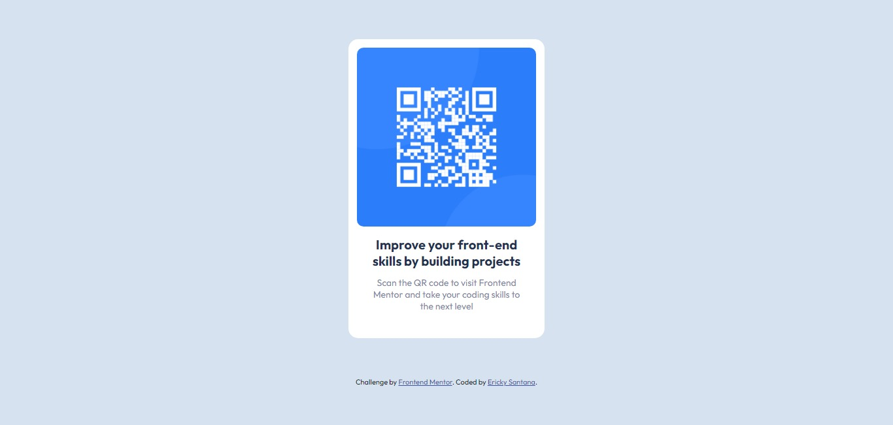
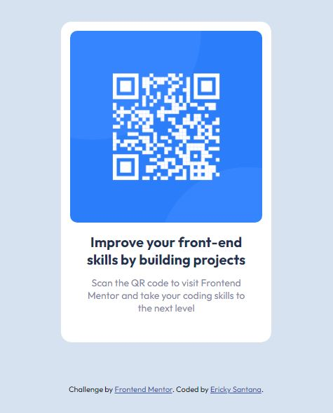

# Frontend Mentor - QR code component solution

This is a solution to the [QR code component challenge on Frontend Mentor](https://www.frontendmentor.io/challenges/qr-code-component-iux_sIO_H).

## Tabela de Conteúdos

- [Overview](#overview)
  - [Screenshot](#screenshot)
  - [Links](#links)
- [My process](#my-process)
  - [Built with](#built-with)
  - [What I learned](#what-i-learned)
  - [Continued development](#continued-development)
- [Author](#author)


## Overview

### Screenshot

#### Desktop



#### Mobile



### Links

- Solution URL: [Github - QR CODE CHALLENGE](https://github.com/erickystn/qrcode-challenge)
- Live Site URL: [Add live site URL here](https://your-live-site-url.com)

## My process

### Built with

- Semantic HTML5 markup
- CSS custom properties
- Flexbox
- Mobile-first workflow
- Vanilla CSS

### What I learned

In this challenge, I was able to recall some good CSS styling practices, making the code less verbose by separating parts of the CSS to enhance readability. Additionally, I combined sections that shared common code in order to avoid unnecessary code duplication.

To see how you can add code snippets, see below:

```html
<main class="container">
  <div class="card">
    
    <h1>Improve your front-end skills by building projects</h1>
    <p>
      Scan the QR code to visit Frontend Mentor and take your coding skills to
      the next level
    </p>
  </div>
</main>
```

```css
html {
  font-size: 62.5%;
}

:root {
  --white: hsl(0, 0%, 100%);
  --light-gray: hsl(212, 45%, 89%);
  --grayish-blue: hsl(220, 15%, 55%);
  --dark-blue: hsl(218, 44%, 22%);
}
```


### Continued development

I plan to keep challenging myself by not only continuing my studies but also putting all the acquired knowledge into practice, especially in more complex projects. I might even consider using a CSS superset along the way.

## Author

- Website - [Ericky GitHub](https://github.com/erickystn/)
- Frontend Mentor - [@erickystn](https://www.frontendmentor.io/profile/erickystn)

