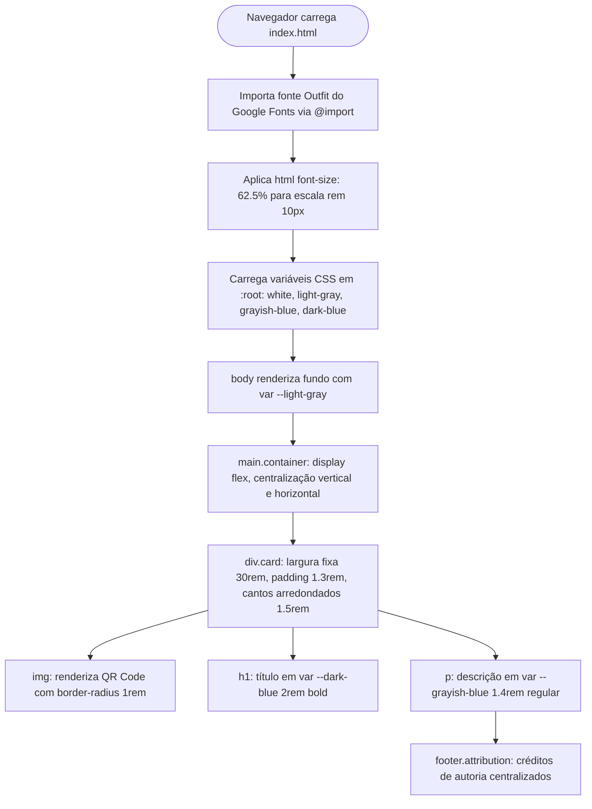

# Frontend Mentor - QR code component solution

<br />

<div align="center">

[](https://qrcode-challenge-psi.vercel.app/)
[](https://www.frontendmentor.io/challenges/qr-code-component-iux_sIO_H)
[](https://developer.mozilla.org/pt-BR/docs/Web/HTML)
[](https://developer.mozilla.org/pt-BR/docs/Web/CSS)
[](https://css-tricks.com/snippets/css/a-guide-to-flexbox/)
[](https://fonts.google.com/specimen/Outfit)
[](LICENSE)
[](#)

</div>

---

This is a solution to the [QR code component challenge on Frontend Mentor](https://www.frontendmentor.io/challenges/qr-code-component-iux_sIO_H). Frontend Mentor challenges help you improve your coding skills by building realistic projects.

---

## Tabela de Conteúdos

- [Overview](#overview)
  - [Screenshot](#screenshot)
  - [Links](#links)
- [My process](#my-process)
  - [Built with](#built-with)
  - [Design Specifications & Variables](#design-specifications--variables)
  - [What I learned](#what-i-learned)
  - [Continued development](#continued-development)
- [Architecture & File Structure](#architecture--file-structure)
- [Component Workflow](#component-workflow)
- [How to Run Locally](#how-to-run-locally)
- [Roadmap](#roadmap)
- [Contributing](#contributing)
- [Author](#author)
- [License](#license)

---

## Overview

### Screenshot

#### Desktop

<details open>
  <summary><strong>🖥️ Visualização Desktop (1440px)</strong></summary>

  <br />

  <div align="center">
    
  </div>

</details>

<br />

#### Mobile

<details>
  <summary><strong>📱 Visualização Mobile (375px)</strong></summary>

  <br />

  <div align="center">
    
  </div>

</details>

---

### Links

- Solution URL: [Github - QR CODE CHALLENGE](https://github.com/erickystn/qrcode-challenge)
- Live Site URL: [Vercel](https://qrcode-challenge-psi.vercel.app/)

---

## My process

### Built with

- Semantic HTML5 markup
- CSS custom properties
- Flexbox
- Mobile-first workflow
- Vanilla CSS

### Design Specifications & Variables

| Recurso / Elemento | Especificação Técnica | Valor / Código |
| :--- | :--- | :--- |
| **Escala de Rem** | `html { font-size: 62.5%; }` | `1rem` = `10px` (facilita cálculos responsivos de tipografia e espaçamento) |
| **Tipografia Principal** | Google Font **Outfit** | Pesos `400` (corpo de texto) e `700` (título principal) |
| **Cor de Fundo (Página)** | `--light-gray` | `hsl(212, 45%, 89%)` |
| **Cor do Card** | `--white` | `hsl(0, 0%, 100%)` com `border-radius: 1.5rem` |
| **Cor do Título (H1)** | `--dark-blue` | `hsl(218, 44%, 22%)` com `font-size: 2rem` |
| **Cor da Descrição (P)** | `--grayish-blue` | `hsl(220, 15%, 55%)` com `font-size: 1.4rem` |

---

### What I learned

In this challenge, I was able to recall some good CSS styling practices, making the code less verbose by separating parts of the CSS to enhance readability. Additionally, I combined sections that shared common code in order to avoid unnecessary code duplication.

To see how you can add code snippets, see below:

```html
<main class="container">
  <div class="card">
    
    <h1>Improve your front-end skills by building projects</h1>
    <p>
      Scan the QR code to visit Frontend Mentor and take your coding skills to
      the next level
    </p>
  </div>
</main>
```

```css
html {
  font-size: 62.5%;
}

:root {
  --white: hsl(0, 0%, 100%);
  --light-gray: hsl(212, 45%, 89%);
  --grayish-blue: hsl(220, 15%, 55%);
  --dark-blue: hsl(218, 44%, 22%);
}
```

---

### Continued development

I plan to keep challenging myself by not only continuing my studies but also putting all the acquired knowledge into practice, especially in more complex projects. I might even consider using a CSS superset along the way.

---

## Architecture & File Structure

```bash
qrcode-challenge/
├── .gitignore                                 # Regras de exclusão de arquivos de design e SO (.DS_Store, *.fig)
├── README.md                                  # Documentação técnica do projeto
├── index.html                                 # Estrutura semântica HTML5 com tags acessíveis
├── css/
│   └── style.css                              # Reset de margens, variáveis HSL, Flexbox e tipografia
├── design/                                    # Screenshots de comparação de fidelidade visual
│   ├── screenshot-desktop.JPG                 # Captura do componente na resolução de 1440px
│   └── screenshot.JPG                         # Captura do componente na resolução mobile de 375px
└── images/                                    # Ativos visuais utilizados na aplicação
    ├── favicon-32x32.png                      # Favicon da aba do navegador
    └── image-qr-code.png                      # Imagem oficial do QR code para o Frontend Mentor
```

---

## Component Workflow


```mermaid
flowchart TD
    A([Navegador carrega index.html]) --> B[Importa fonte Outfit do Google Fonts via @import]
    B --> C[Aplica html font-size: 62.5% para escala rem 10px]
    C --> D[Carrega variáveis CSS em :root: white, light-gray, grayish-blue, dark-blue]
    D --> E[body renderiza fundo com var --light-gray]
    E --> F[main.container: display flex, centralização vertical e horizontal]
    F --> G[div.card: largura fixa 30rem, padding 1.3rem, cantos arredondados 1.5rem]
    G --> H[img: renderiza QR Code com border-radius 1rem]
    G --> I[h1: título em var --dark-blue 2rem bold]
    G --> J[p: descrição em var --grayish-blue 1.4rem regular]
    J --> K[footer.attribution: créditos de autoria centralizados]
```

---

## How to Run Locally

### Prerequisites
* Any modern web browser (Google Chrome, Mozilla Firefox, Microsoft Edge, Safari).
* [Git](https://git-scm.com/) installed.

### Steps

1. Clone the repository:
```bash
git clone https://github.com/erickystn/qrcode-challenge.git
```

2. Enter the project folder:
```bash
cd qrcode-challenge
```

3. Open `index.html` in your browser:
```bash
# On Linux / macOS
open index.html

# On Windows
start index.html
```
*Or open the folder in VS Code and use the **Live Server** extension.*

---

## Roadmap

- [ ] **QR Code Interativo:** Permitir que o usuário insira qualquer URL personalizada para gerar um QR Code em tempo real via JavaScript.
- [ ] **Modo Escuro (Dark Mode):** Alternador de tema aproveitando as variáveis CSS em `:root`.
- [ ] **Efeito Hover no Card:** Adicionar transição sutil com elevação de sombra (`box-shadow` e `transform: translateY`).
- [ ] **Botão de Download:** Adicionar botão para baixar o QR Code gerado em formato PNG ou SVG.

---

## Contributing

1. Fork the project.
2. Create your feature branch:
   ```bash
   git checkout -b feature/amazing-feature
   ```
3. Commit your changes:
   ```bash
   git commit -m "feat: add interactive QR code generator"
   ```
4. Push to the branch:
   ```bash
   git push origin feature/amazing-feature
   ```
5. Open a Pull Request.

---

## Author

- Website - [Ericky GitHub](https://github.com/erickystn/)
- Frontend Mentor - [@erickystn](https://www.frontendmentor.io/profile/erickystn)

---

## License

This project is licensed under the **MIT License**. Feel free to use this code for educational and portfolio purposes.
