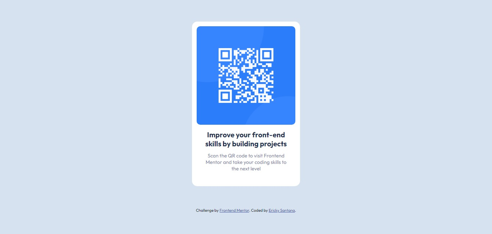
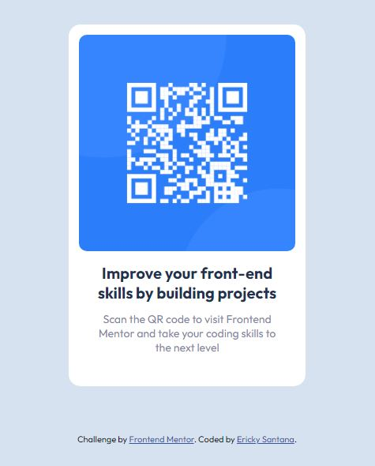
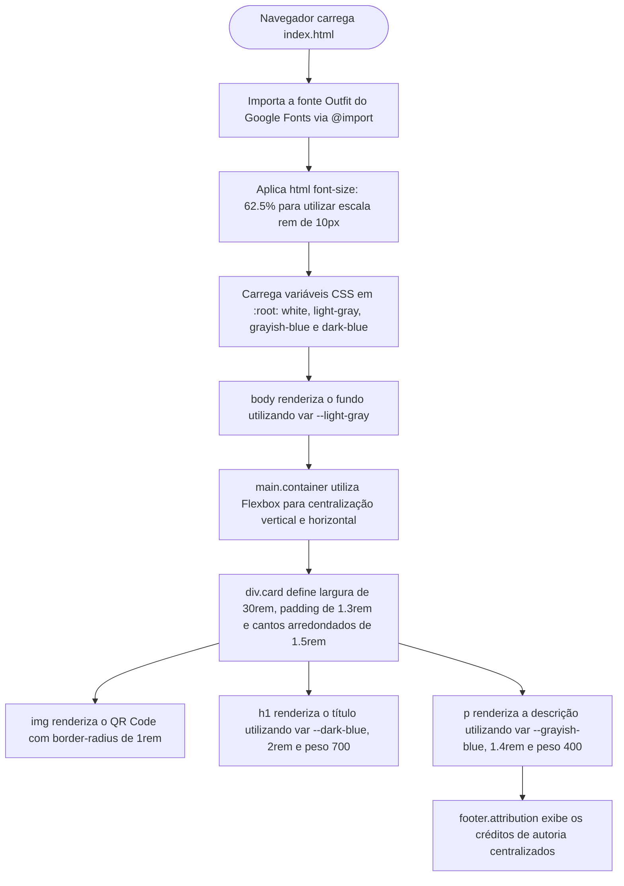

# Frontend Mentor - Solução do desafio QR Code Component

<br />

<div align="center">

[](https://qrcode-challenge-psi.vercel.app/)
[](https://www.frontendmentor.io/challenges/qr-code-component-iux_sIO_H)
[](https://developer.mozilla.org/pt-BR/docs/Web/HTML)
[](https://developer.mozilla.org/pt-BR/docs/Web/CSS)
[](https://css-tricks.com/snippets/css/a-guide-to-flexbox/)
[](https://fonts.google.com/specimen/Outfit)
[](LICENSE)
[](#)

</div>

---

Este projeto é uma solução para o desafio [QR code component do Frontend Mentor](https://www.frontendmentor.io/challenges/qr-code-component-iux_sIO_H). Os desafios do Frontend Mentor têm como objetivo aprimorar as habilidades de desenvolvimento por meio da construção de projetos baseados em situações reais.

---

## Tabela de Conteúdos

* [Visão Geral](#visão-geral)

  * [Capturas de Tela](#capturas-de-tela)
  * [Links](#links)
* [Processo de Desenvolvimento](#processo-de-desenvolvimento)

  * [Tecnologias Utilizadas](#tecnologias-utilizadas)
  * [Especificações de Design e Variáveis](#especificações-de-design-e-variáveis)
  * [O que Aprendi](#o-que-aprendi)
  * [Desenvolvimento Contínuo](#desenvolvimento-contínuo)
* [Arquitetura e Estrutura de Arquivos](#arquitetura-e-estrutura-de-arquivos)
* [Fluxo do Componente](#fluxo-do-componente)
* [Como Executar Localmente](#como-executar-localmente)
* [Roadmap](#roadmap)
* [Contribuição](#contribuição)
* [Autor](#autor)
* [Licença](#licença)

---

## Visão Geral

### Capturas de Tela

#### Desktop

<details open>
  <summary><strong>🖥️ Visualização Desktop (1440px)</strong></summary>

  <br />

  <div align="center">
    
  </div>

</details>

<br />

#### Mobile

<details>
  <summary><strong>📱 Visualização Mobile (375px)</strong></summary>

  <br />

  <div align="center">
    
  </div>

</details>

---

### Links

* **Repositório:** [GitHub - QR Code Challenge](https://github.com/erickystn/qrcode-challenge)
* **Aplicação publicada:** [Vercel](https://qrcode-challenge-psi.vercel.app/)

---

## Processo de Desenvolvimento

### Tecnologias Utilizadas

* HTML5 semântico
* Propriedades personalizadas do CSS (CSS Custom Properties)
* Flexbox
* Abordagem Mobile First
* CSS puro (Vanilla CSS)

### Especificações de Design e Variáveis

| Recurso / Elemento         | Especificação Técnica        | Valor / Código                                                    |
| :------------------------- | :--------------------------- | :---------------------------------------------------------------- |
| **Escala de Rem**          | `html { font-size: 62.5%; }` | `1rem` = `10px`, facilitando cálculos de tipografia e espaçamento |
| **Tipografia Principal**   | Google Font **Outfit**       | Pesos `400` (corpo de texto) e `700` (título principal)           |
| **Cor de Fundo da Página** | `--light-gray`               | `hsl(212, 45%, 89%)`                                              |
| **Cor do Card**            | `--white`                    | `hsl(0, 0%, 100%)` com `border-radius: 1.5rem`                    |
| **Cor do Título (H1)**     | `--dark-blue`                | `hsl(218, 44%, 22%)` com `font-size: 2rem`                        |
| **Cor da Descrição (P)**   | `--grayish-blue`             | `hsl(220, 15%, 55%)` com `font-size: 1.4rem`                      |

---

### O que Aprendi

Neste desafio, pude relembrar boas práticas de estilização com CSS e tornar o código mais enxuto, separando diferentes responsabilidades para melhorar sua organização e legibilidade.

Também agrupei regras que compartilhavam características em comum, evitando duplicação desnecessária de código e tornando a manutenção do projeto mais simples.

Por exemplo, a estrutura principal do componente utiliza HTML semântico:

```html
<main class="container">
  <div class="card">
    
    <h1>Melhore suas habilidades de front-end desenvolvendo projetos</h1>
    <p>
      Escaneie o QR Code para visitar o Frontend Mentor e levar suas habilidades
      de desenvolvimento para o próximo nível.
    </p>
  </div>
</main>
```

As principais cores utilizadas no projeto foram centralizadas em variáveis CSS:

```css
html {
  font-size: 62.5%;
}

:root {
  --white: hsl(0, 0%, 100%);
  --light-gray: hsl(212, 45%, 89%);
  --grayish-blue: hsl(220, 15%, 55%);
  --dark-blue: hsl(218, 44%, 22%);
}
```

Essa abordagem facilita a manutenção e permite alterar a identidade visual do projeto de forma centralizada.

---

### Desenvolvimento Contínuo

Pretendo continuar colocando em prática os conhecimentos adquiridos por meio de projetos cada vez mais complexos.

Além de continuar meus estudos, quero explorar novas ferramentas e abordagens de desenvolvimento, incluindo a possibilidade de utilizar pré-processadores ou outras tecnologias que possam tornar meus projetos mais organizados e escaláveis.

---

## Arquitetura e Estrutura de Arquivos

```bash
qrcode-challenge/
├── .gitignore                                 # Regras de exclusão de arquivos de design e do sistema operacional
├── README.md                                  # Documentação técnica do projeto
├── index.html                                 # Estrutura semântica HTML5 com tags acessíveis
├── css/
│   └── style.css                              # Reset de margens, variáveis HSL, Flexbox e tipografia
├── design/                                    # Capturas utilizadas para comparação da fidelidade visual
│   ├── screenshot-desktop.JPG                 # Captura do componente na resolução de 1440px
│   └── screenshot.JPG                         # Captura do componente na resolução mobile de 375px
└── images/                                    # Recursos visuais utilizados na aplicação
    ├── favicon-32x32.png                      # Ícone da aba do navegador
    └── image-qr-code.png                      # Imagem oficial do QR Code fornecida pelo Frontend Mentor
```

---

## Fluxo do Componente


```mermaid
flowchart TD
    A([Navegador carrega index.html]) --> B[Importa a fonte Outfit do Google Fonts via @import]
    B --> C[Aplica html font-size: 62.5% para utilizar escala rem de 10px]
    C --> D[Carrega variáveis CSS em :root: white, light-gray, grayish-blue e dark-blue]
    D --> E[body renderiza o fundo utilizando var --light-gray]
    E --> F[main.container utiliza Flexbox para centralização vertical e horizontal]
    F --> G[div.card define largura de 30rem, padding de 1.3rem e cantos arredondados de 1.5rem]
    G --> H[img renderiza o QR Code com border-radius de 1rem]
    G --> I[h1 renderiza o título utilizando var --dark-blue, 2rem e peso 700]
    G --> J[p renderiza a descrição utilizando var --grayish-blue, 1.4rem e peso 400]
    J --> K[footer.attribution exibe os créditos de autoria centralizados]
```

---

## Como Executar Localmente

### Pré-requisitos

* Um navegador moderno, como Google Chrome, Mozilla Firefox, Microsoft Edge ou Safari.
* [Git](https://git-scm.com/) instalado.

### Passo a Passo

**1. Clone o repositório:**

```bash
git clone https://github.com/erickystn/qrcode-challenge.git
```

**2. Acesse a pasta do projeto:**

```bash
cd qrcode-challenge
```

**3. Abra o arquivo `index.html` no navegador:**

No Linux/macOS:

```bash
open index.html
```

No Windows:

```bash
start index.html
```

Também é possível abrir a pasta do projeto no VS Code e utilizar a extensão **Live Server** para executar a aplicação com recarregamento automático.

---

## Roadmap

* [ ] **QR Code Interativo:** Permitir que o usuário insira uma URL personalizada para gerar um QR Code em tempo real utilizando JavaScript.
* [ ] **Modo Escuro:** Adicionar um alternador de tema utilizando as variáveis CSS definidas em `:root`.
* [ ] **Efeito Hover no Card:** Adicionar uma transição sutil com elevação utilizando `box-shadow` e `transform: translateY`.
* [ ] **Botão de Download:** Permitir o download do QR Code gerado nos formatos PNG ou SVG.

---

## Contribuição

Contribuições são bem-vindas.

**1. Faça um fork do projeto.**

**2. Crie uma branch para sua funcionalidade:**

```bash
git checkout -b feature/nova-funcionalidade
```

**3. Faça o commit das alterações:**

```bash
git commit -m "feat: adiciona gerador de QR Code interativo"
```

**4. Envie a branch para o repositório:**

```bash
git push origin feature/nova-funcionalidade
```

**5. Abra um Pull Request.**

---

## Autor

* **GitHub:** [Ericky GitHub](https://github.com/erickystn/)
* **Frontend Mentor:** [@erickystn](https://www.frontendmentor.io/profile/erickystn)

---

## Licença

Este projeto está licenciado sob a **Licença MIT**.

O código pode ser utilizado, modificado e distribuído livremente, inclusive para fins educacionais e de portfólio, de acordo com os termos da licença.
